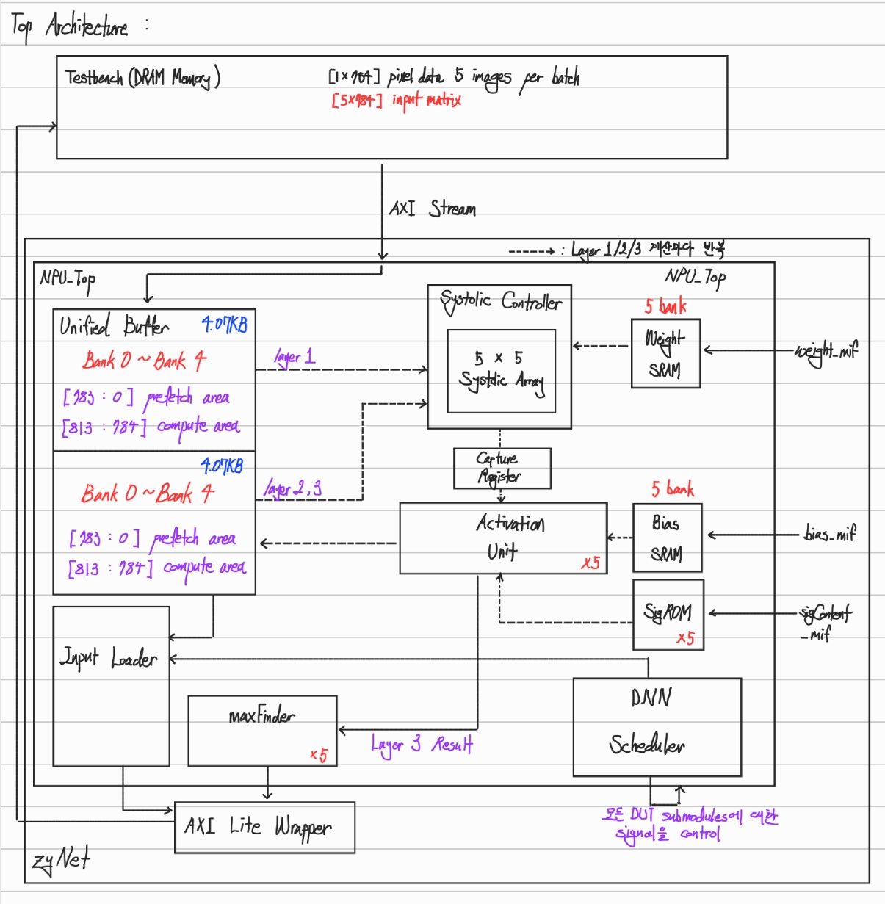
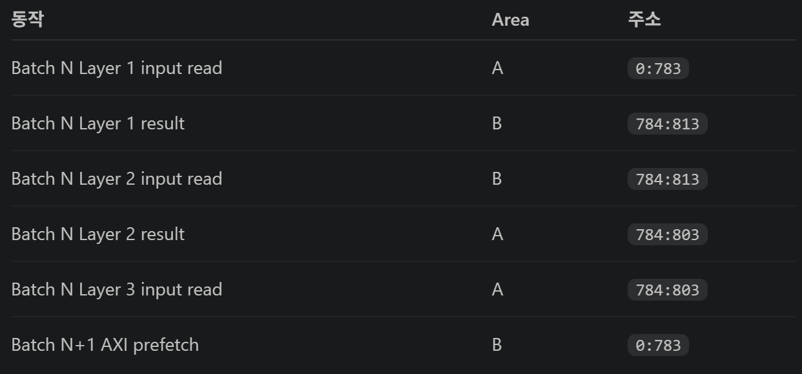

# Unified Buffer And AXI Latency Hiding Architecture Optimization Specification

- 문서 ID: OPT-SPEC-001
- 버전: 0.1
- 상태: draft-for-review
- 선행 조건: 승인된 Reference Model SPEC, Systolic Accelerator SPEC 및 검증 완료된 Systolic Prototype
- 적용 범위: Unified Buffer, Input Loader, DNN Scheduler, AXI-Stream Input Scheduling 및 PPA 구현 규칙

## 1. 목적

본 문서는 기존 Input Buffer와 Global Buffer의 기능을 하나의 Unified Buffer로 통합하고, 현재 Batch의 Compute 시간에 다음 Batch의 AXI-Stream Input을 Prefetch하여 Batch 사이의 입력 Latency를 숨기는 최적화 아키텍처를 정의한다.

최적화의 우선순위는 다음과 같다.

1. 얕고 분리된 Buffer를 5-bank Unified Buffer로 통합하여 FPGA BRAM Inference와 Memory Packing 가능성을 높인다.
2. 첫 Batch를 제외한 AXI Load를 Compute와 겹쳐 End-to-End Cycle을 줄인다.
3. 외부 결과 Protocol, 수치 정확도와 5×5 Output-Stationary Systolic Controller의 연산 의미를 유지한다.
4. 추가 최적화는 정확도와 Protocol을 훼손하지 않는 범위에서 PPA Report로 판단한다.

Unified Buffer의 논리 용량은 증가한다. 따라서 Area 또는 BRAM Block 감소는 명세만으로 보장하지 않으며, 합성 결과로 검증해야 하는 설계 가설이다.

## 2. Normative Evidence Boundary

본 SPEC의 구현은 승인된 RAG Source와 검증된 Systolic Prototype만 근거로 사용한다. 승인되지 않은 비교용 구현이나 외부 설계 사례를 구현 근거로 사용하지 않는다. 근거가 없거나 서로 충돌하는 결정은 임의로 채우지 않고 `unknown`으로 보고한 뒤 SPEC 승인을 다시 받아야 한다.

첨부 그림은 사용자가 제공한 설계 의도 자료이다. 그림 안의 모든 Block이 자동으로 Requirement가 되는 것은 아니다. 본문과 `REQ-OPT-*`가 규범적이며, 그림에 있는 Capture Register와 별도의 MaxFinder Input Register는 필수 구현으로 요구하지 않는다.

## 3. Optimized Top Architecture



Top-Level Dataflow는 다음과 같다.

```text
AXI-Stream Input
       |
       v
+---------------------------+
| Input Loader              |
| Batch Counter/Prefetch    |
+---------------------------+
       |
       v
+---------------------------------------------------+
| Unified Buffer: 5 Banks                           |
| Area A: input[0:783], intermediate[784:813]       |
| Area B: input[0:783], intermediate[784:813]       |
+---------------------------------------------------+
       | current Layer source
       v
+----------------------+      +--------------------+
| Systolic Controller  | <--- | Weight SRAM       |
| 5x5 Systolic Array   |      +--------------------+
+----------------------+      +--------------------+
       | partial sums          | Bias SRAM/SigROM  |
       v                       +--------------------+
+----------------------+
| Activation Unit      |
+----------------------+
       | Layer 1/2: Unified Buffer intermediate area
       | Layer 3: MaxFinder path
       v
MaxFinder -> axi_lite_wrapper -> 0x08 Results / intr

DNN Scheduler controls compute ownership and layer/group sequencing.
Input Loader independently controls next-Batch prefetch ownership.
```

Reference Model에서 계승된 `zyNet`, `axi_lite_wrapper`, `maxFinder` Module 이름과 외부 Port 이름은 유지한다. 새 기능 Block의 이름은 기능을 명확히 나타내는 이름을 사용하며, Parameter는 `UPPER_SNAKE_CASE`, Signal/Register/Counter는 full-name lowercase `snake_case`를 사용한다.

## 4. Unified Buffer Organization

Unified Buffer는 8-bit Q1.7 Data를 저장하는 5개 Bank로 구성한다. 각 Bank는 동일한 주소 구조의 논리 Area A와 Area B를 가진다.

| 항목 | 값 |
|---|---:|
| Bank Count | 5 |
| Data Width | 8 bit signed Q1.7 |
| Area Count Per Bank | 2: A/B |
| Local Depth Per Area | 814 entries |
| Input Region | local address `0:783` |
| Intermediate Region | local address `784:813` |
| Physical Depth Per Bank | 1,628 entries |
| Total Logical Capacity | `5 × 2 × 814 = 8,140 byte` |

물리 주소는 다음과 같이 계산할 수 있다.

```text
physical_address = area_base + local_address
area_base(A) = 0
area_base(B) = 814
```

동일한 기능을 만족하는 주소 Encoding을 사용할 수 있지만, A/B Ownership과 Local Address 의미는 유지해야 한다.

### 4.1 Region Meaning

- `0:783`: image 한 개의 784개 Feature를 저장한다. Bank 0~4가 Batch의 image 0~4에 대응한다.
- `784:813`: 최대 30개 Layer 1 Activation을 저장한다.
- Layer 2 결과 20개는 `784:803`만 사용한다.
- Layer 3 결과는 기본 Dataflow에서 Unified Buffer에 저장하지 않고 MaxFinder 경로로 전달한다.
- 사용하지 않는 주소의 값은 기능적 의미가 없으며, Valid Metadata가 없는 Stale Data를 읽어서는 안 된다.

### 4.2 Batch N Mapping



Batch N에서 Area A가 Current Area라면 다음 Mapping을 사용한다.

| 동작 | Area | Local Address |
|---|---|---|
| Batch N Layer 1 Input Read | A | `0:783` |
| Batch N Layer 1 Result Write | B | `784:813` |
| Batch N Layer 2 Input Read | B | `784:813` |
| Batch N Layer 2 Result Write | A | `784:803` |
| Batch N Layer 3 Input Read | A | `784:803` |
| Batch N+1 AXI Prefetch | B | `0:783` |

Batch N이 끝나면 A/B 역할을 교환한다. Batch N+1에서는 B가 Current Area, A가 Prefetch Area가 된다.

## 5. AXI-Stream Input And Batch Prefetch

외부 Signal 이름과 Width, `axis_in_data_valid && axis_in_data_ready`에서만 Transfer가 성립한다는 AXI-Stream 규칙은 유지한다. Input Order는 Batch별 Image-Major이다.

```text
Batch b:
  image 5b+0 feature 0..783
  image 5b+1 feature 0..783
  image 5b+2 feature 0..783
  image 5b+3 feature 0..783
  image 5b+4 feature 0..783
```

### 5.1 Intentional Ready Behavior Change

Prototype의 상시 `axis_in_data_ready=1` 규칙은 Optimization 단계에서 그대로 유지할 수 없다. Prefetch Slot이 가득 찬 뒤에도 Transfer를 계속 승인하면 아직 계산하지 않은 Batch Data가 덮어써지기 때문이다.

따라서 다음 계약을 적용한다.

- Initial Batch를 저장할 빈 Area가 있으면 `axis_in_data_ready=1`이다.
- Current Batch Compute 중 Next Batch용 Prefetch Area가 비어 있으면 `axis_in_data_ready=1`이다.
- 5×784 Transfer가 완료되어 Prefetch Area가 가득 차면 Area가 Current로 승격될 때까지 `axis_in_data_ready=0`이다.
- Buffer Port가 Activation Write에 사용되어 Prefetch Write를 받을 수 없는 Cycle에는 `axis_in_data_ready=0`으로 Backpressure한다.
- `axis_in_data_valid=1`이고 `axis_in_data_ready=0`인 동안 Sender는 Data와 Valid를 유지해야 한다.
- Stall은 Data Loss, 중복 Count 또는 Image/Feature 순서 변경을 일으켜서는 안 된다.

이 변경은 Signal Interface를 바꾸는 것이 아니라 AXI-Stream의 기존 Ready/Valid 의미를 정상적으로 사용하는 Scheduling 최적화이다.

### 5.2 Prefetch Ownership

Input Loader는 다음 Metadata를 동등한 의미로 관리해야 한다.

- Current Area
- Prefetch Area
- Prefetch Valid/Complete
- Image Index `0:4`
- Feature Index `0:783`

전체 Input Matrix를 별도 Register Array로 복제해서는 안 된다. Transfer된 Data는 Unified Buffer의 Prefetch Area에 직접 기록한다.

Prefetch Area는 5×784 Transfer가 모두 완료된 뒤에만 Complete가 된다. DNN Scheduler는 Current Batch의 Result Protocol이 끝났고 Prefetch Complete가 참일 때만 Area Ownership을 교환하고 다음 Compute를 시작한다. Prefetch가 늦으면 정확성을 우선하여 대기한다.

## 6. AXI Latency Hiding Schedule

목표 Timeline은 다음과 같다.

```text
Time ->
Batch 0: [AXI Load][---------- Compute ----------]
Batch 1:            [AXI Load][---------- Compute ----------]
Batch 2:                       [AXI Load][---------- Compute ----------]
```

Batch 0은 빈 Buffer를 채워야 하므로 AXI Load Latency가 노출된다. Batch 1 이후의 Load는 이전 Batch Compute와 겹친다.

한 Batch의 AXI Transfer Cycle을 `L`, Compute 및 Result 준비 Window를 `C`라고 할 때, Prefetch가 완전히 숨겨지는 필요조건은 다음과 같다.

```text
L <= C_overlap
```

연속 Valid이고 Cycle당 1개 8-bit Feature를 전송하면 `L = 5 × 784 = 3,920` Transfer Cycle이다. `C_overlap`은 Prefetch를 허용한 실제 Compute 구간에서 Activation Write 충돌로 Backpressure된 Cycle을 제외한 값이다.

Prefetch가 완료되는 정상 Steady State의 Batch 간 Compute 시작 간격은 입력과 계산을 직렬화한 `L + C`가 아니라 대략 `max(L, C)`가 된다. 전체 20-Batch Latency는 최초 Load와 마지막 Drain을 별도로 포함해 측정해야 한다.

다음 경우에는 AXI Latency가 완전히 숨겨지지 않을 수 있다.

- Upstream `axis_in_data_valid` Stall
- Unified Buffer Port Conflict로 인한 Ready Backpressure
- `L > C_overlap`
- 이전 Batch의 AXI-Lite Result Read 지연

이 경우 구현은 Data를 덮어쓰지 말고 Scheduler를 대기시켜야 하며, 측정 결과에 노출된 Stall Cycle과 원인을 기록해야 한다.

## 7. Unified Buffer Port And Collision Rules

FPGA BRAM 추론을 위해 Read는 Synchronous 1-Cycle Latency를 기본으로 한다. Memory Array 전체를 Reset하지 않고 Ownership, Valid, Address Counter와 같은 Metadata만 Reset한다.

Port 우선순위는 다음과 같다.

1. Current Layer Operand Read
2. Activation Result Write
3. Next Batch AXI Prefetch Write

Compute Read와 Activation Write가 서로 다른 주소에서 동시에 필요하면 True Dual-Port 동작으로 구현한다. 같은 Cycle에 세 번째 Prefetch Access가 필요하거나 동일 Bank의 허용 Port 수를 넘으면 Prefetch만 Stall하고 `axis_in_data_ready=0`으로 만든다. Compute 결과나 Activation Write를 버려서는 안 된다.

다음 충돌을 검증해야 한다.

- Layer 1: Current Area Input Read와 Opposite Area Intermediate Write
- Layer 2: Opposite Area Intermediate Read와 Current Area Intermediate Write
- Layer 3: Current Area Intermediate Read와 Next Batch Prefetch Write
- Activation Write와 동일 Bank의 AXI Prefetch Write
- Area Swap 경계에서 마지막 Read/Write와 첫 Next-Batch Read

Read-During-Write 동작이 FPGA Device 설정에 의존하면 동일 주소 충돌을 Scheduling으로 금지해야 한다. Simulation Model과 Synthesis Inference의 Read-During-Write 의미가 달라서는 안 된다.

## 8. DNN Scheduler And Input Loader

DNN Scheduler는 Layer/Group/Tile/Activation/MaxFinder/Result 순서를 관리한다. Input Loader는 AXI Transfer와 Prefetch Area를 독립적으로 관리한다. 하나의 거대한 FSM에 모든 상태를 직렬화하여 Prefetch가 Compute를 기다리게 해서는 안 된다.

DNN Scheduler는 다음 조건을 보장해야 한다.

- Batch 0은 Initial Load Complete 뒤 Compute를 시작한다.
- Batch N Compute 중 Batch N+1 Prefetch를 허용한다.
- 현재 Layer가 읽는 Area와 Activation이 쓰는 Area를 명시적으로 선택한다.
- Layer 1/2는 Unified Buffer Intermediate Region을 사용한다.
- Layer 3 Activation은 Unified Buffer에 저장하지 않고 MaxFinder로 전달한다.
- Current Batch 결과가 준비되면 Batch당 1-Cycle `intr`를 발생시킨다.
- AXI-Lite byte address `0x08`에서 class 5개를 image 순서로 읽는 계약을 유지한다.
- 다섯 번째 Result Read Handshake가 완료되기 전에는 결과를 덮어쓰지 않는다.
- 다음 Batch가 Prefetch Complete여도 Result Protocol이 끝나지 않았으면 Compute 전환을 기다린다.

## 9. Preserved Compute And Numeric Contracts

다음 항목은 Optimization으로 변경하지 않는다.

- 5×5 Output-Stationary Systolic Array
- `IDLE`, `RUN`, `DONE_STATE` Controller 의미와 1-Cycle Start/Done 계약
- SRAM Streaming Adapter와 Matrix Register 복제 금지
- Layer 1/2/3의 6/4/2 Group
- Group별 797/43/33 Target Cycle
- Q1.7 × Q4.4 → Q15.11, Bias Q5.3, Sigmoid Input Q5.5, Activation Output Q1.7
- Q5.5 LUT Address Saturation과 `sigContent.mif`
- 100개 Image, 20개 Batch, Batch당 image 5개
- Classification, Tie Rule, `0x08` Result와 `intr` 의미

Buffer의 Synchronous Read 또는 새로운 Arbitration 때문에 Controller Cycle 변경이 불가피하면 구현 전에 변경 이유와 새 Cycle 식을 보고하고 SPEC 승인을 받아야 한다.

## 10. Additional PPA Requirements

### 10.1 BRAM-Friendly RTL

- Unified Buffer는 5-bank Synchronous Memory Template으로 작성한다.
- Memory Data Array에 비동기 Read나 전체 Reset Loop를 사용하지 않는다.
- Bank별 Read/Write Enable을 사용하여 불필요한 Toggle을 줄인다.
- Device 종속 Primitive를 직접 고정하기 전에 Portable Inference RTL을 우선한다.
- 합성 Report에서 MLAB/LUT RAM으로 분산됐는지 BRAM으로 추론됐는지 확인한다.

### 10.2 Control And Counter Width

- Counter와 Address Width는 표현 범위에 필요한 최소 Width를 Parameter/Localparam에서 계산한다.
- Area 선택은 1-bit Ownership으로 관리하고 큰 Data MUX 대신 Address Base 선택을 우선한다.
- 반복 Decode는 공통 Control Signal로 묶되, Critical Fan-Out이 커지면 Register Duplication 여부를 합성 결과로 판단한다.

### 10.3 Power

- FPGA Clock Gating Cell을 임의로 만들지 않고 Clock Enable을 사용한다.
- 사용하지 않는 Bank, Systolic PE Update, SRAM Read와 SigROM Lookup은 Enable로 정지한다.
- Valid가 없는 Stale Data 변경이 Datapath Toggle을 유발하지 않게 한다.

### 10.4 Optional Exploration, Not Mandatory Structure

- SigROM 공유는 Area를 줄일 수 있지만 5-Lane 처리량을 낮출 수 있으므로 단일 정답으로 고정하지 않는다.
- 추가 Pipeline은 Fmax를 높일 수 있지만 Cycle과 Handshake를 바꾸므로 사전 보고와 승인이 필요하다.
- Capture Register 또는 MaxFinder Input Register는 본 SPEC의 필수 Block이 아니다. Timing Closure 때문에 필요하다고 판단하면 근거, Latency와 Interface 영향을 먼저 보고해야 한다.

## 11. PPA Measurement And Acceptance

최적화 효과는 RTL 모양이 아니라 동일한 FPGA Family, Synthesis Option과 Timing Constraint의 Report로 판단한다.

필수 비교 항목은 다음과 같다.

- Functional Regression: 100 Samples, 99 PASS / 1 FAIL, Accuracy 99.0%
- Total Cycle과 Batch별 Cycle
- 최초 Batch Load Cycle
- Steady-State Batch 간 간격
- AXI Ready Low Cycle, Source Valid Stall Cycle, Prefetch Wait Cycle
- ALM/Logic Element, Register, Memory Bit, BRAM Block 수
- Fmax와 Worst Slack
- 가능하면 Dynamic/Static Power Estimate

최적화 성공 조건은 기능·수치·Protocol Regression을 통과하고, 다음 두 핵심 목표 중 측정 가능한 Gain을 보이는 것이다.

1. 첫 Batch 이후 AXI Load가 Compute에 대부분 또는 전부 숨겨져 Total Cycle이 감소한다.
2. Unified Buffer가 목표 FPGA에서 더 안정적인 BRAM Inference 또는 유리한 Memory Block Packing을 보인다.

논리 Memory Capacity 증가는 허용된 Trade-Off이지만, BRAM Block 수와 Area가 모두 악화되고 Performance Gain도 없으면 구조를 재검토해야 한다.

## 12. Requirements

- REQ-OPT-001: Input Buffer와 Global Buffer의 기능을 하나의 5-bank Unified Buffer로 통합해야 한다.
- REQ-OPT-002: 각 Bank는 A/B 두 논리 Area와 Area별 814개의 8-bit Q1.7 Entry를 가져야 한다.
- REQ-OPT-003: 각 Area의 `0:783`은 Batch Input, `784:813`은 Intermediate Activation에 사용해야 한다.
- REQ-OPT-004: Layer 1 결과는 Opposite Area `784:813`, Layer 2 결과는 Current Area `784:803`에 저장해야 한다.
- REQ-OPT-005: Layer 3 Activation은 기본 Dataflow에서 Unified Buffer에 저장하지 않고 MaxFinder 경로로 전달해야 한다.
- REQ-OPT-006: Batch가 끝날 때 Current Area와 Prefetch Area의 역할을 교환해야 한다.
- REQ-OPT-007: Batch 0은 Initial AXI Load 완료 후 Compute를 시작해야 한다.
- REQ-OPT-008: Batch N Compute 중 Batch N+1의 Image-Major 5×784 Input을 Prefetch Area에 저장해야 한다.
- REQ-OPT-009: Prefetch Area가 가득 차거나 Memory Port가 없으면 `axis_in_data_ready=0`으로 Backpressure해야 한다.
- REQ-OPT-010: AXI Transfer는 오직 `axis_in_data_valid && axis_in_data_ready`에서 Count해야 한다.
- REQ-OPT-011: Prefetch Complete와 Current Result Protocol 완료 전에는 Area Ownership을 교환해서는 안 된다.
- REQ-OPT-012: Input Loader와 DNN Scheduler는 AXI Prefetch와 Compute가 병렬 진행될 수 있게 제어를 분리해야 한다.
- REQ-OPT-013: 전체 Input Matrix를 별도 Controller Register Array로 복제해서는 안 된다.
- REQ-OPT-014: Unified Buffer는 1-Cycle Synchronous Read와 Bank별 Enable을 사용하는 BRAM-Friendly RTL이어야 한다.
- REQ-OPT-015: Memory Data Array 전체를 Reset하지 않고 Valid와 Ownership Metadata만 Reset해야 한다.
- REQ-OPT-016: Port 충돌 시 Compute Read, Activation Write, AXI Prefetch Write 순으로 우선하고 Prefetch를 Stall해야 한다.
- REQ-OPT-017: Image-Major Order, Fixed-Point, Systolic Controller, MaxFinder와 AXI-Lite `0x08` Result 계약을 유지해야 한다.
- REQ-OPT-018: `intr`는 Batch 결과가 준비될 때 Batch당 정확히 한 번, 1 cycle assertion해야 한다.
- REQ-OPT-019: `zyNet`, `axi_lite_wrapper`, `maxFinder`의 계승 Module 이름과 외부 Port 이름을 유지해야 한다.
- REQ-OPT-020: Parameter는 `UPPER_SNAKE_CASE`, 새 Signal/Register/Counter는 full-name lowercase `snake_case`를 사용해야 한다.
- REQ-OPT-021: Counter와 Address는 필요한 범위의 최소 Width를 사용하고 Area 선택은 Address Base MUX를 우선해야 한다.
- REQ-OPT-022: Inactive Memory와 Datapath는 Clock Enable 또는 Bank Enable로 Toggle을 억제해야 한다.
- REQ-OPT-023: Capture Register와 MaxFinder Input Register를 필수 구조로 간주해서는 안 된다.
- REQ-OPT-024: `L > C_overlap` 또는 Input Stall이면 Data를 덮어쓰지 않고 다음 Compute를 대기하며 Stall 원인을 기록해야 한다.
- REQ-OPT-025: 동일 조건의 합성·시뮬레이션에서 기능, Cycle, BRAM, Logic, Register, Fmax와 가능한 Power를 보고해야 한다.

## 13. Verification Items

- Area A/B와 Bank 0~4의 Image-Major Address Mapping
- 3,920개 Transfer에서만 Prefetch Complete가 되는지 확인
- Prefetch Full에서 `axis_in_data_ready=0` 및 Data 안정성 확인
- Random `axis_in_data_valid` Stall과 Ready Backpressure 조합
- Layer 1/2 Read/Write와 Prefetch의 Port Collision Assertion
- Area Swap 전후 마지막/첫 주소 경계 Assertion
- Batch 0 Load 노출과 Batch 1~19 Load/Compute Overlap 측정
- Prefetch 미완료 시 안전한 Scheduler Wait
- AXI-Lite Result Read 지연 중 결과 보존
- Layer 3의 Unified Buffer Write 부재와 MaxFinder 전달
- 797/43/33 Controller Cycle 또는 승인된 변경 Cycle
- Q5.5 Saturation과 100-Sample 99% Regression
- 20개 Batch의 `intr` 1-Cycle Pulse
- Memory Array Reset Loop 부재와 Synchronous BRAM Inference
- Synthesis Resource, Fmax와 Power Report 수집
